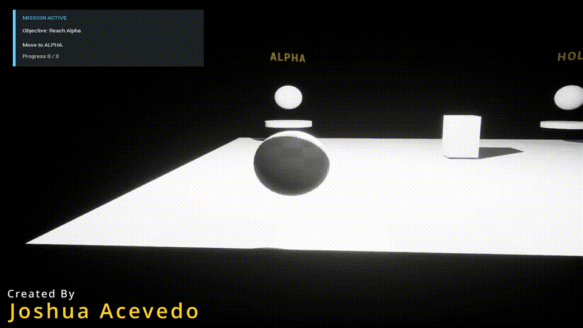

# Mission Systems Lab

Mission Systems Lab is a UE 5.8 C++ gameplay systems demo focused on data-driven mission flow, runtime state management, player-facing objectives, and structured event logging. The current slice implements a small playable scenario where the player follows objective markers, completes a hold step, and interacts with a console through an on-screen HUD.

- **Status:** P1 playable runtime demo complete
- **Engine:** Unreal Engine 5.8
- **Language:** C++
- **Focus:** Mission / quest runtime systems, gameplay state, HUD feedback, validation, source-controlled Unreal project structure

## Demo

[](Media/GitHub/MissionSystemsLabDemo.mp4)

[Watch the full gameplay demo](Media/GitHub/MissionSystemsLabDemo.mp4)

## Demo Flow

Open the project, press Play, and complete the scenario:

1. Move to `ALPHA` to complete the reach objective.
2. Move to `HOLD` and remain in the marker area until the hold timer completes.
3. Move to `CONSOLE`.
4. Press `E` when the HUD says `Press E to interact with CONSOLE.`

The HUD shows the current mission state, objective, instruction, and progress.

## Engineering Highlights

- **Data-driven mission contract:** Scenario phases and objectives are defined from JSON and parsed into Blueprint-visible C++ structs.
- **Runtime state machine:** `UMissionScenarioInstance` owns initialization, start, objective completion, reset, failure, and completed-state behavior.
- **Playable objective loop:** The demo pawn completes objectives through marker proximity, hold timing, and input-gated interaction.
- **HUD objective guidance:** `AMissionScenarioDemoHUD` keeps the current objective visible during normal viewport Play.
- **Structured event log:** Runtime events can be exported as JSON for diagnostics, replay, or debrief-style tooling.
- **Plugin-first Unreal architecture:** Mission logic lives in `Plugins/MissionScenarioRuntime` instead of being buried in level-only Blueprint logic.

## Project Structure

| Path | Purpose |
| --- | --- |
| `MissionSystemsLab.uproject` | UE 5.8 host project. |
| `Content/P1_MissionScenarioRuntime/Maps/P1_DemoScenario.umap` | Playable demo map. |
| `Plugins/MissionScenarioRuntime/Source/MissionScenarioRuntime` | Runtime mission system plugin. |
| `Config/DefaultEngine.ini` | Startup/default map configuration. |
| `Config/DefaultInput.ini` | Movement, camera, and `E` interaction input mappings. |

## Key Code

- `MissionScenarioTypes.h`: scenario data structs and objective type enum.
- `MissionScenarioRuntimeLibrary.cpp`: JSON parsing and validation entry points.
- `MissionScenarioInstance.cpp`: mission lifecycle and event log runtime.
- `MissionScenarioDemoActor.cpp`: placed demo scenario owner.
- `MissionScenarioDemoPawn.cpp`: movement, marker checks, hold timer, and console interaction.
- `MissionScenarioDemoHUD.cpp`: screen-space objective panel.
- `MissionScenarioDemoGameMode.cpp`: demo pawn and HUD wiring.

## How to Run

Requirements:

- Unreal Engine 5.8
- Visual Studio 2022 with C++ game development tools
- Git LFS enabled before cloning

Clone:

```bash
git lfs install
git clone https://github.com/Zoruahful/MissionSystemsLab.git
```

Open:

```text
MissionSystemsLab.uproject
```

Build target:

```powershell
& 'Path\To\UE_5.8\Engine\Build\BatchFiles\Build.bat' MissionSystemsLabEditor Win64 Development 'Path\To\MissionSystemsLab\MissionSystemsLab.uproject' -WaitMutex -FromMsBuild
```

Then open `/Game/P1_MissionScenarioRuntime/Maps/P1_DemoScenario` and press Play.

## Scope

This repository is intentionally small. It demonstrates the core runtime and playable mission loop, not a full game. The current implementation focuses on durable C++ systems, clear player feedback, and a simple end-to-end demo path that can be inspected in code and played in editor.
